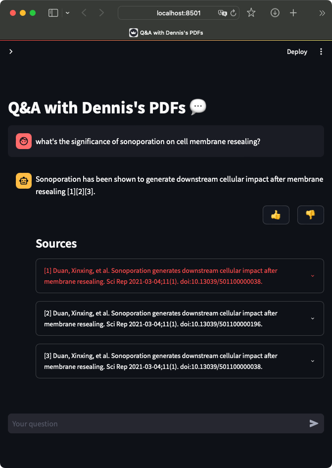

# Mind Palace

Mind Palace is an early experiment aimed at enhancing how we learn from academic papers. As consultants, we often struggle with long onboarding times when entering new, complex science fields. Our goal with Mind Palace is to streamline this process through an interactive Q&A tool focused on academic papers.



## Getting Started

To spin up the web app, run:

```
$ streamlit run mind_palace/app.py
```

## Pre-requisites

- Python 3.11
- venv

```
$ python3 -m venv venv
$ source venv/bin/activate
$ pip3 install -r requirements/dev.txt
```

When done, remember to run

```
deactivate
```

### Fill in secrets

Copy `.streamlit/secrets.toml_template` as `.streamlit/secrets.toml` and fill in those secrets.
