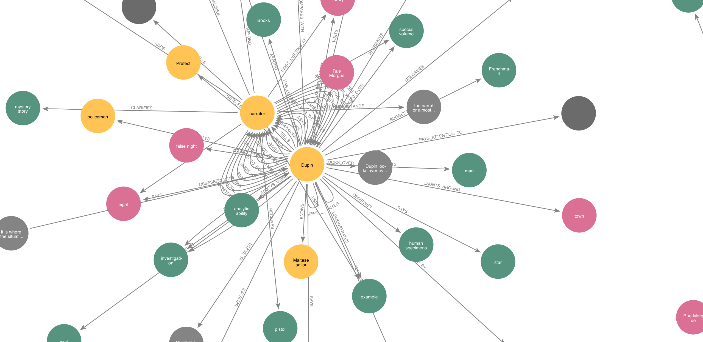
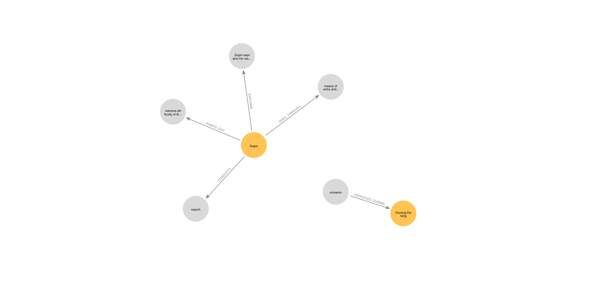
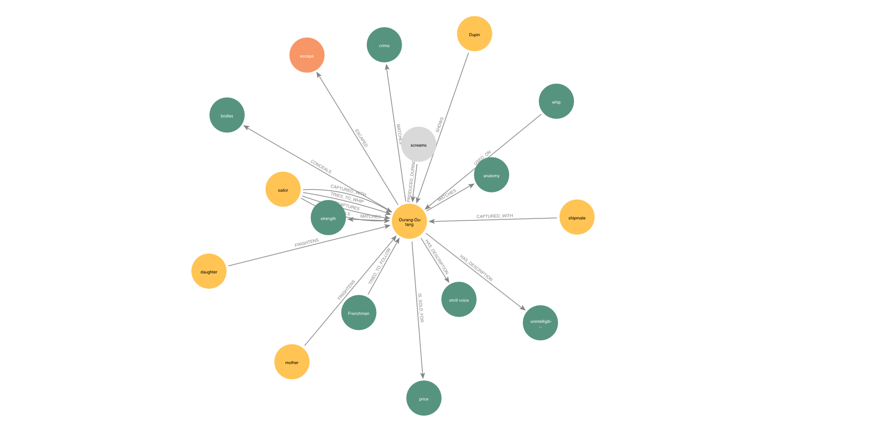
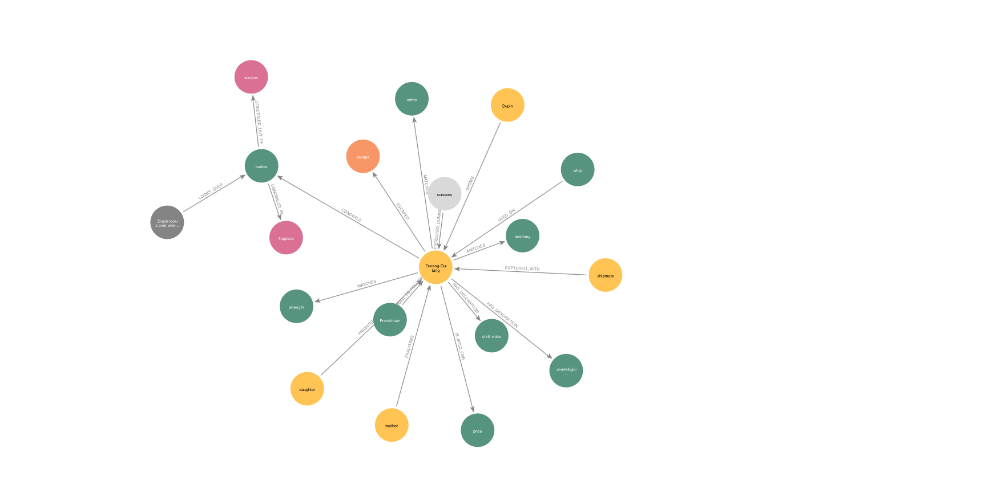

# Murders in Rue Morgue property graph v1

A v1 property graph model of the murders in Edgar Allen Poe's short story "The Murders in the Rue Morgue".



## Accessing the graph

This model is persisted on our Neo4J database at `neo4j+s://96bb6c6e.databases.neo4j.io`.

## Graph Construction

Going from text directly to Cypher ends up with a disconnected graph that's all over the place (it's a quality spectrum, because it still is, just less so). Thus, we need to provide some modelling constraint. Here's an approach taken for this v1 model,

Applying a 2 stage approach.

Stage 1 `modelling_nodes.md`, semi-manual top-down analysis using [a third-party summary](../resources/murders_in_rue_morgue_summary.txt) with LLM to establish constraints to the graph model. Particularly limiting the node types. Do this once.

Stage 2 `modelling_relations.md`, using the node types from Stage 1, apply a series of guided reasoning prompts to parse each paragraph into Cypher. Iterate this over every paragraph one at a time.

Reference: https://github.com/TheDataGuild/mind-palace/pull/1

Note that we're using a third-party summary instead of the original text so that it's easier to go back and forth manually while figuring out this process. One of the next steps is to do-away with this extra summary requirement.

### Final Graph Source Code

The source code for the produced graph is at `rue_morgue_llm.cypher`.

## Solving the crime

Can we solve this crime using only the property graph and no prior knowledge?

First, let's see what node labels we have.

```
$ match (n) return distinct labels(n);

["Object"]
["Location"]
["Character"]
["neighbors"]
["police"]
["Testimony"]
[]
["Evidence"]
["Event"]
```

We see that there are two node labels that are relevant to our investigation: Evidence and Character. Let's use the Neo4J Bloom Explorer to see which characters are connected to evidences.



Character `Ourang-Outang` seems suspicious with its connection to `screams`. Let's see what other relations Ourang-Outang has by expanding all its neighbours.



The relation `CONCEALS` between `Ourang-Outang` and `bodies` seems important. Let's expand the `bodies` node to see what other relations it has.



At this point, we hit a roadblock. The relations between `bodies` and the `mother` and `daughter` (victims) are missing. These relations were mentioned in the text, but they were not extracted from the text.

The relation between `screams` and a `Testimony` by a `Witness` is also missing. This is another critical piece of information that is not in the data.

Without these missing relations, we cannot solve the crime. The data extraction process failed to extract these important relations. If these relations had been extracted, we would have been able to identify and proof `Ourang-Outang` as the murderer.

## Known shortcomings

The current text-to-graph pipeline has the following shortcomings:

- Dirty data: There are some inconsistencies in the data, such as the entity "police" and "policeman" being treated as two different nodes.
- Erroneous relations: Some of the relations in the graph are incorrect, such as the relation `(dupin)-[:BELONGS_TO]->(sailor)`, which does not make sense.
- Missing relations: Some of the necessary relations are missing, such as the relation `(bodies)-[:BELONGS_TO]->(mother)`.
- Large quantity of errors: There are a large number of errors in the graph.
- Lack of source reference: See [ticket](https://github.com/TheDataGuild/mind-palace/issues/2)

## Next Step Ideas

Here are some ideas for how to improve the quality of the text-to-graph pipeline:

- Measure quality: We need to develop a way to measure the quality of a text-to-graph pipeline. This will allow us to compare different approaches and identify the best one.
- Divide and conquer: We can break down the pipeline into smaller steps and optimize each step individually. This will make it easier to identify and correct errors.
- Step back: We can step back to more simplistic, more deterministic models. For example, we could use NER (named entity recognition) and co-occurrence only graph.
- Fine-tune/LoRA a text-to-property-graph LLM: Similar to how a foundational model is fine-tuned for instructions, or chat, or domain specific tasks.

